<div align="center">
  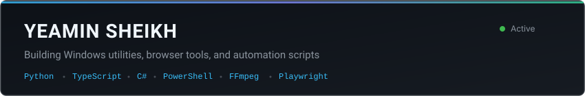
</div>

```bash
yeamin@workstation:~$ fastfetch --config profile
OS: Windows 11 Pro x86_64
Role: Systems & Automation Developer
Stack: Python, TypeScript, C#, PowerShell
Tooling: FFmpeg, Playwright, Chrome Extensions (MV3), .NET
Location: Bangladesh
```

### Selected projects

<table width="100%">
  <tr>
    <td width="50%" valign="top">
      <a href="https://github.com/Yeamin-Sheikh/dola-extension">
        <b>dola-extension</b>
      </a>
      <p>Chrome extension that strips watermarks and handles batch downloads on the Dola AI video platform.</p>
      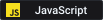
      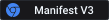
    </td>
    <td width="50%" valign="top">
      <a href="https://github.com/Yeamin-Sheikh/yeaprompts">
        <b>yeaprompts</b>
      </a>
      <p>Offline prompt database and web interface storing 279 tested video prompts with instant search and SQLite storage.</p>
      
      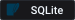
    </td>
  </tr>
  <tr>
    <td width="50%" valign="top">
      <a href="https://github.com/Yeamin-Sheikh/yt-adjust">
        <b>yt-adjust</b>
      </a>
      <p>Chrome extension adding mouse-wheel volume controls, audio boost, picture-in-picture, and automatic sponsor skipping.</p>
      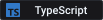
      
    </td>
    <td width="50%" valign="top">
      <a href="https://github.com/Yeamin-Sheikh/Audify">
        <b>Audify</b>
      </a>
      <p>Windows system tray daemon that reads clipboard text aloud using Microsoft Edge neural speech synthesis voices.</p>
      
      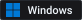
    </td>
  </tr>
  <tr>
    <td width="50%" valign="top">
      <a href="https://github.com/Yeamin-Sheikh/windows-cloud-sandbox">
        <b>windows-cloud-sandbox</b>
      </a>
      <p>Automated GitHub Actions workflow that provisions an ephemeral cloud Windows workstation accessible via RDP and Tailscale.</p>
      
      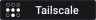
    </td>
    <td width="50%" valign="top">
      <a href="https://github.com/Yeamin-Sheikh/csharp-fundamentals">
        <b>csharp-fundamentals</b>
      </a>
      <p>Curated collection of introductory C# console projects covering terminal I/O, error handling, and basic algorithms.</p>
      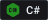
      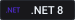
    </td>
  </tr>
</table>

### Engineering stack

<p>
  
  
  
  
  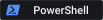
  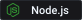
  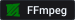
  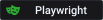
  
</p>

### Contribution activity

<picture>
  <source media="(prefers-color-scheme: dark)" srcset="https://raw.githubusercontent.com/Yeamin-Sheikh/Yeamin-Sheikh/output/github-contribution-grid-snake-dark.svg">
  <source media="(prefers-color-scheme: light)" srcset="https://raw.githubusercontent.com/Yeamin-Sheikh/Yeamin-Sheikh/output/github-contribution-grid-snake.svg">
  
</picture>
